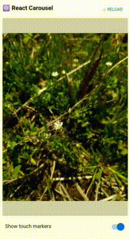

# react-touch-transform

CSS Transforms for touch gestures ⁽⁽👆⁾⁾



## Development

```bash
$ # clone the repo
$ git clone <this project>
$ cd <this project>
$ 
$ # install development dependencies
$ npm i -D
```

### Scripts

#### Serve the document with the development server

Launch the document in the development mode to interact with the stuff inside the package:

```bash
$ npm run doc:dev # lauches the development server on http://0.0.0.0:8000.
```

#### Linting, formatting and type checking

```bash
$ npm run lint # linting
$ npm run fmt # auto-formatting
$ npm run typecheck # type checking
```

#### Build the package

```bash
$ npm run pkg:build # builds the package into both CommonJS and ES6 Modules.
```
